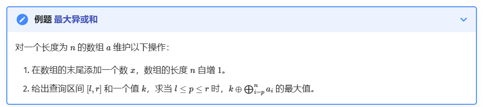
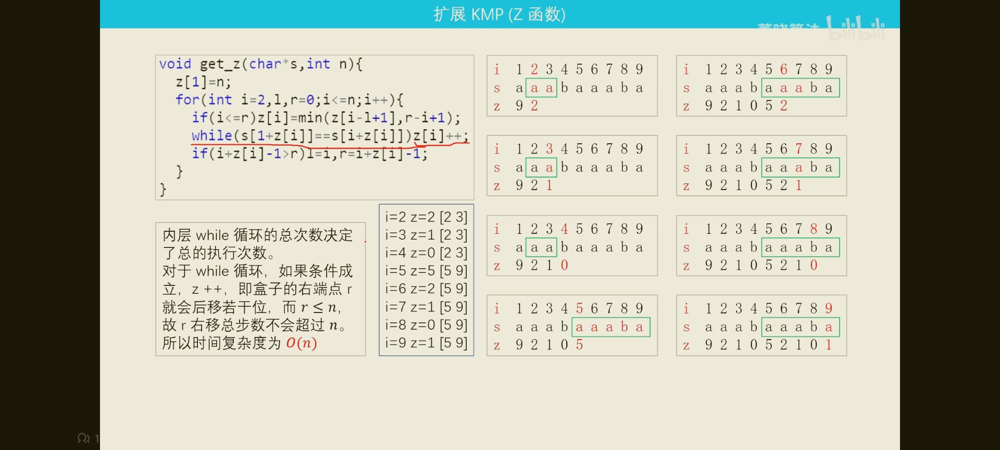
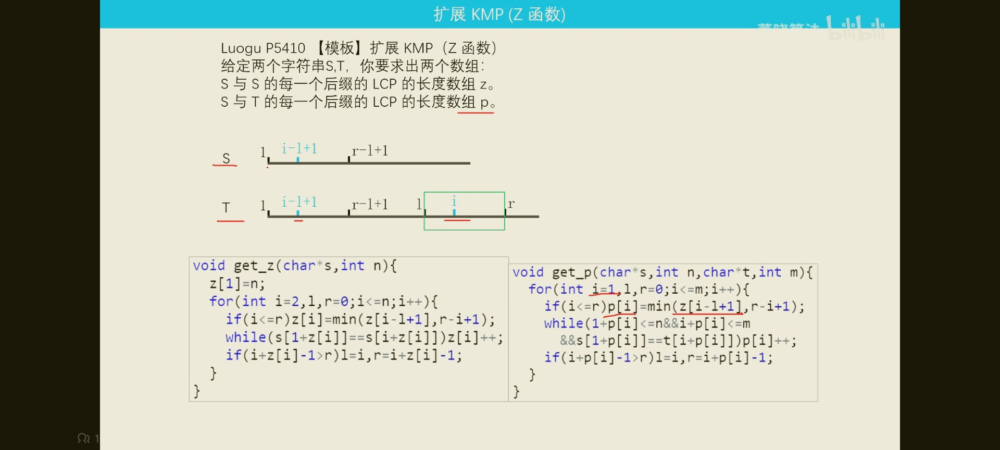
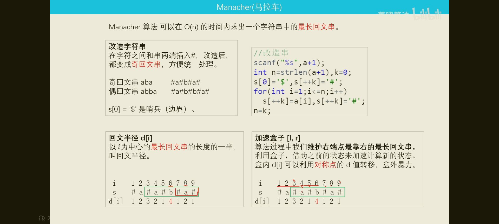
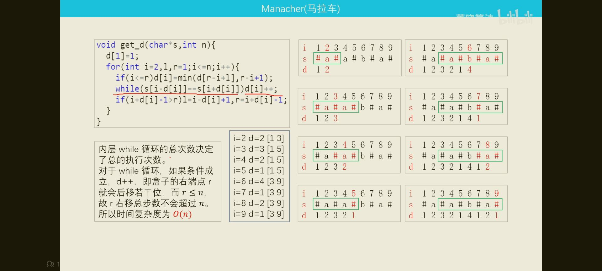

## 三分
~~~c++
//整数三分模板
int l = 1,r = 100;
while(l < r) {
    int lmid = l + (r - l) / 3; // l + 1/3区间大小
    int rmid = r - (r - l) / 3;  // r - 1/3区间大小
    lans = cal(lmid),rans = cal(rmid);
    // 求凹函数的极小值
    if(lans <= rans) r = rmid - 1;
    else l = lmid + 1;
    // 求凸函数的极大值
    if(lasn >= rans) l = lmid + 1;
    else r = rmid - 1;
}
// 求凹函数的极小值
cout << min(lans,rans) << endl;
// 求凸函数的极大值
cout << max(lans,rans) << endl;
~~~
~~~c++
//浮点数三分模板
const double EPS = 1e-9;
while(r - l < EPS) {
    double lmid = l + (r - l) / 3;
    double rmid = r - (r - l) / 3;
    lans = cal(lmid),rans = cal(rmid);
    // 求凹函数的极小值
    if(lans <= rans) r = rmid;
    else l = lmid;
    // 求凸函数的极大值
    if(lans >= rans) l = lmid;
    else r = rmid;
}
// 输出 l 或 r 都可
cout << l << endl;
~~~
## 字符串单哈希
~~~c++
struct Dhash
{
    typedef unsigned long long ull;
    const int P = 13331;
    const int N = 1e5 + 10;
    vector<ull> h, p;
    void init(string s)
    {
        int n = s.size();
        h.resize(n + 1), p.resize(n + 1);
        s = ' ' + s;
        p[0] = 1;
        for (int i = 1; i <= n; i++)
        {
            p[i] = p[i - 1] * P;
            h[i] = h[i - 1] * P + s[i];
        }
    }

    ull get(int l, int r) { return h[r] - h[l - 1] * p[r - l + 1]; }
    bool same(int l1, int r1, int l2, int r2)
    {
        return get(l1, r1) == get(l2, r2);
    }
};
~~~
## 字典树/可持久化字典树
~~~c++
//普通字典树
//这里是转换为01求2数异或最大值
int nex[5000000][2]{};
int cnt[5000000][2]{};
int num=0;
void insert(int x){
    int p=0;
    for(int i=20;i>=0;i--){
        int c=(x>>i)&1;
        if(!nex[p][c])nex[p][c]=++num;
        p=nex[p][c];
        cnt[p][c]++;
    }
}
void erase(int x){
    int p=0;
    for(int i=20;i>=0;i--){
        int c=(x>>i)&1;
        int temp=p;
        p=nex[p][c];
        cnt[p][c]--;
        if(cnt[p][c]==0)nex[temp][c]=0;
    }
}
int find(int x){
    int p=0,ans=0;
    for(int i=20;i>=0;i--){
        int c=(x>>i)&1;
        if(nex[p][c^1]){
            p=nex[p][c^1];
            ans+=1<<i;
        }else{
            p=nex[p][c];
        }
    }
    return ans;
}
~~~

~~~c++
//可持久化字典树
#include <algorithm>
#include <cstdio>
#include <cstring>
using namespace std;
const int maxn = 600010;
int n, q, a[maxn], s[maxn], l, r, x;
char op;

struct Trie {
  int cnt, rt[maxn], ch[maxn * 33][2], val[maxn * 33];

  void insert(int o, int lst, int v) {
    for (int i = 28; i >= 0; i--) {
      val[o] = val[lst] + 1;  // 在原版本的基础上更新
      if ((v & (1 << i)) == 0) {
        if (!ch[o][0]) ch[o][0] = ++cnt;
        ch[o][1] = ch[lst][1];
        o = ch[o][0];
        lst = ch[lst][0];
      } else {
        if (!ch[o][1]) ch[o][1] = ++cnt;
        ch[o][0] = ch[lst][0];
        o = ch[o][1];
        lst = ch[lst][1];
      }
    }
    val[o] = val[lst] + 1;
    // printf("%d\n",o);
  }

  int query(int o1, int o2, int v) {
    int ret = 0;
    for (int i = 28; i >= 0; i--) {
      // printf("%d %d %d\n",o1,o2,val[o1]-val[o2]);
      int t = ((v & (1 << i)) ? 1 : 0);
      if (val[ch[o1][!t]] - val[ch[o2][!t]])
        ret += (1 << i), o1 = ch[o1][!t],
                         o2 = ch[o2][!t];  // 尽量向不同的地方跳
      else
        o1 = ch[o1][t], o2 = ch[o2][t];
    }
    return ret;
  }
} st;

int main() {
  scanf("%d%d", &n, &q);
  for (int i = 1; i <= n; i++) scanf("%d", a + i), s[i] = s[i - 1] ^ a[i];
  for (int i = 1; i <= n; i++)
    st.rt[i] = ++st.cnt, st.insert(st.rt[i], st.rt[i - 1], s[i]);
  while (q--) {
    scanf(" %c", &op);
    if (op == 'A') {
      n++;
      scanf("%d", a + n);
      s[n] = s[n - 1] ^ a[n];
      st.rt[n] = ++st.cnt;
      st.insert(st.rt[n], st.rt[n - 1], s[n]);
    }
    if (op == 'Q') {
      scanf("%d%d%d", &l, &r, &x);
      l--;
      r--;
      if (l == 0)
        printf("%d\n", max(s[n] ^ x, st.query(st.rt[r], st.rt[0], s[n] ^ x)));
      else
        printf("%d\n", st.query(st.rt[r], st.rt[l - 1], s[n] ^ x));
    }
  }
  return 0;
}
~~~
## ac自动机
【模板】AC 自动机（简单版）

## 题目描述

给定 $n$ 个模式串 $s_i$ 和一个文本串 $t$，求有多少个不同的模式串在文本串里出现过。  
两个模式串不同当且仅当他们**编号**不同。

## 输入格式

第一行是一个整数，表示模式串的个数 $n$。  
第 $2$ 到第 $(n + 1)$ 行，每行一个字符串，第 $(i + 1)$ 行的字符串表示编号为 $i$ 的模式串 $s_i$。  
最后一行是一个字符串，表示文本串 $t$。
~~~c++
#include<bits/stdc++.h>
#define N 500010
using namespace std;
queue<int>q;
struct ac{
    int c[N][26],val[N],fail[N],cnt;
    void ins(string&s){
        int len=s.size();int now=0;
        for(int i=0;i<len;i++){
            int v=s[i]-'a';
            if(!c[now][v])c[now][v]=++cnt;
            now=c[now][v];
        }
        val[now]++;
    }
    void build(){
        for(int i=0;i<26;i++)if(c[0][i])fail[c[0][i]]=0,q.push(c[0][i]);
        while(!q.empty()){
            int u=q.front();q.pop();
            for(int i=0;i<26;i++)
            if(c[u][i])fail[c[u][i]]=c[fail[u]][i],q.push(c[u][i]);
            else c[u][i]=c[fail[u]][i];
        }
    }
    int query(string&s){
        int len=s.size();int now=0,ans=0;
        for(int i=0;i<len;i++){
            now=c[now][s[i]-'a'];
            for(int t=now;t&&~val[t];t=fail[t])ans+=val[t],val[t]=-1;
        }
        return ans;
    }
}AC;
int main(){
    ios::sync_with_stdio(0);cin.tie(0),cout.tie(0);
    int n;cin>>n;
    string p;
    for(int i=1;i<=n;i++)cin>>p,AC.ins(p);
    AC.build();
    cin>>p;
    int ans=AC.query(p);
    cout<<ans;
}
~~~
## 扩展kmp

## 马拉车

